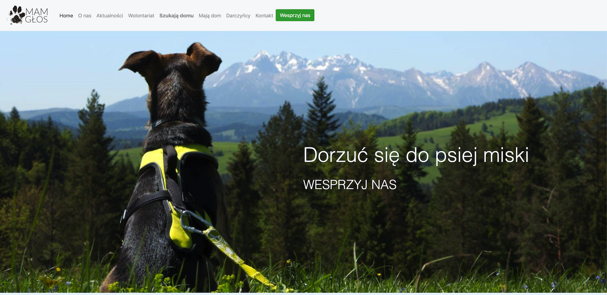

# Mam Głos

See it live: www.mamglos-ns.pl

## Table of contents
* General info
* Technologies

## General info
I've made this website voluntarily for a little dog shelter in my home town. 
It's not much, but every little helps :).
They can now add the dogs they're taking care of and looking for loving homes for them, add the partners that help them regularly, thanks notes to one-time helpers or schools, found and lost animals in the town,  and some news.

## Technologies
* Python
* Django2

